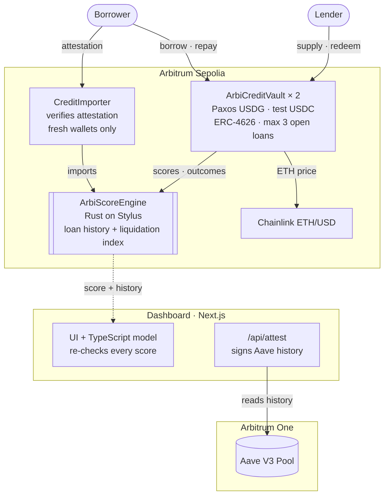
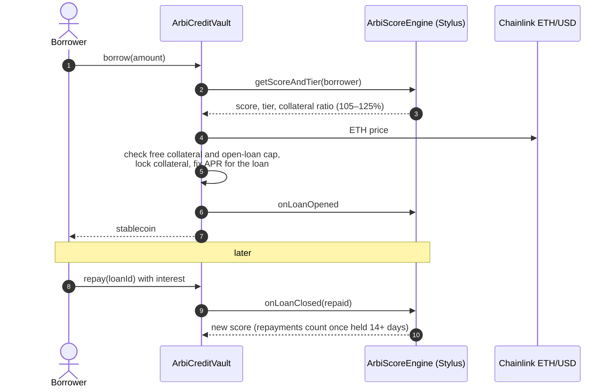

# ArbiScore

**A credit layer where your repayment history lowers your collateral. The risk model runs in Rust on Arbitrum Stylus, and two lending markets (Paxos USDG and test USDC) share it.**

### ▶ Live app: **[arbiscore-openhouse.vercel.app](https://arbiscore-openhouse.vercel.app)**

Runs on Arbitrum Sepolia. It opens in a sandbox with sample borrowers; connect a wallet to use the live markets ([how to try it](#try-it-judges)). Built for the Arbitrum Open House Singapore Online Buildathon (2026).

**Prior art.** An unrelated earlier project, [ARBISCORE](https://ethglobal.com/showcase/arbiscore-0yqup) (ETHGlobal Agentic Ethereum, February 2025), proposed a Q-learning credit agent on Stylus. I came across it during AI-assisted research. Its repository is a Stylus template with the model's storage declared but no scoring or lending logic. This project shares no code with it; the model, markets, Aave import and benchmarks were built for this buildathon.

**How it was built.** ArbiScore is a solo project. AI coding tools (Google Antigravity and Claude Code) proposed options and wrote most of the code. I chose the problem, picked between the options, and made the product calls: what to build, what to cut, and which tradeoffs to accept. Those decisions are listed with their reasons and costs under [Decisions and tradeoffs](#decisions-and-tradeoffs).

---

## The problem

**Who has this problem:** borrowers on Arbitrum with a long, clean repayment record, such as an Aave user who has borrowed and repaid stablecoins against ETH for two years.

**What they do today:** they post the same collateral as a wallet created this morning. Lending protocols set one collateral ratio per asset for everyone, because wallets are pseudonymous and bad debt can't be pursued. Aave V3 on Arbitrum, for example, lets any wallet borrow up to 80% of its WETH's value, which means at least **125% collateral**, whatever that wallet's record. So every borrower is priced the same, and years of repayment history sit on-chain unused.

**How big the gap is:** I sampled 20,857 wallets that had borrowed on Aave V3 (Arbitrum One) before March 2026. Only **2.25%** were liquidated in the following 180 days (see [the model](#weights-fitted-to-real-aave-data)). The other 97.75% got no credit for it: they were asked for the same collateral as any brand-new wallet.

## What ArbiScore does

1. **Scores repayment history on-chain.** A logistic-regression credit model, running in Rust on Stylus, scores every wallet from its loan history.
2. **Runs lending markets around that score.** Two markets, **Paxos USDG** and **test USDC**, share one credit engine, so a repayment in either market improves your terms in both. In each:
   - Lenders supply the stablecoin and earn interest (ERC-4626 `asUSDG` / `asUSDC` shares).
   - Borrowers post WETH at a collateral ratio set by their tier: **105%** for Prime, **112%**, **118%**, or **125%** for Subprime, which is Aave V3's rate for WETH on Arbitrum. A score only ever lowers your collateral below the market; it never raises it.
   - Borrowers pay a fixed APR set by pool utilization plus a tier risk premium.
   - Every repayment or liquidation is written back into the borrower's shared history.
3. **Makes credit portable.** New wallets don't have to start from zero. Closed Aave V3 loans on Arbitrum One are indexed, signed as an EIP-712 attestation, verified on-chain by `CreditImporter`, and scored immediately.

**What makes the score hard to game** (each is tested; see `contracts/test_vectors/model_properties.ts` and `scripts/scenarios.ts`):
- **Wallet-hopping doesn't help.** A new wallet scores Subprime and borrows at 125%, the same as Aave. Walking away from a bad history only returns you to market terms, where a bad history already puts you.
- **Wash-borrowing doesn't help.** Credit from a repaid loan scales with how long it was outstanding (full at 14 days), and every loan pays interest. On a new wallet, 1, 3 or 64 instant borrow-and-repay loops leave the score exactly where it started.
- **Dust farming doesn't help.** A wallet can hold at most **3 open loans per market**. Without that cap, 64 simultaneous $1 loans held two weeks lifted a fresh wallet to Near-Prime for $0.18 of interest. With it, the same trick is still Subprime after two months, and never reaches Prime within a year. An honest $5,000-a-month borrower reaches Prime in about two months.
- **Liquidations can't be buried.** The model reads the latest 64 loans, **plus the 16 most recent liquidations even when they're older than that**. Taking 64 tiny loans no longer pushes a liquidation out of view.
- **No better than Subprime while in default.** While any loan is overdue and unpaid, the score is capped at 599 (Subprime, the 125% market rate). Repaying it, even late, lifts the cap.
- **Paying late is partly a default.** A loan becomes liquidatable 3 days after its due date, so repayment credit halves for every 5 days late and the rest counts as default weight. Repaying always beats staying overdue, but a loan repaid 15 or more days late never scores above not having borrowed at all.

## The model

A fixed-point **logistic regression** over seven features computed from the wallet's latest 64 loans:

| Feature | How it's computed |
|---|---|
| Repayment quality | Each repaid loan is weighted by **recency** (half-life of 180 days), **size** (√amount) and **seasoning** (time outstanding, full at 14 days). A loan repaid 5 days late keeps half its credit, and the other half counts as a default. Beta-prior smoothing keeps a thin history from producing an extreme score |
| Credit depth | Total weighted evidence, saturating. A loan still open past its due date adds none |
| Liquidations | Weighted liquidations, which fade over time once they're in the past. The 16 most recent still count even when they're older than the 64-loan window. An open loan past its due date counts as a full liquidation that does **not** fade while it stays unpaid, and caps the score at 599 until it's repaid. The late part of a late repayment counts here too |
| Utilization | Open principal relative to the largest loan the wallet has repaid |
| Wallet age, activity, volume | Saturating curves |

`score = 300 + 550 × sigmoid(β · features)`. The score maps to tiers: Prime ≥750 → 105%, Near-Prime ≥680 → 112%, Moderate ≥600 → 118%, Subprime → 125% (Aave V3's WETH rate on Arbitrum; new wallets start here).

### Weights fitted to real Aave data

The weights are fitted to real borrower outcomes on **Aave V3, Arbitrum One** ([`research/fit-weights`](research/fit-weights)), so the model is checked against real defaults rather than asserted:

- **No look-ahead.** Features are computed from each wallet's Aave history up to a cutoff 180 days ago, using the same indexer code as live imports. The label is whether the wallet was **liquidated in the 180 days after**.
- **A known shock in the window.** The label window (27 March to 23 September 2026) includes the [rsETH exploit](https://governance.aave.com/t/rseth-incident-report-april-20-2026/24580) of 18 April, after which Aave froze WETH on Arbitrum at 0% LTV until about 18 May. That may have shifted liquidation patterns in this sample. My dataset doesn't timestamp liquidations, so I can't separate its effect. The out-of-time check below uses an earlier period that ends before the exploit, and the model holds there.
- **Sample:** 1,791 borrowers, 683 of them liquidated in that window (liquidations are over-sampled; the base rate is 2.25%).
- **Fit:** sign-constrained logistic regression. Out-of-sample AUC averaged over 20 random 70/30 splits:

| Weights | AUC, all wallets | AUC, wallets with debt open at cutoff |
|---|---|---|
| Previous hand-set weights | 0.712 | 0.681 |
| Unconstrained fit | 0.778 | 0.750 |
| **Shipped: fit with guardrails** | **0.744** | **0.723** |

The unconstrained fit leans almost entirely on Aave activity and volume, and gives no weight to repayment depth. Activity and volume are cheap to farm, and ignoring depth would mean repaying ArbiScore loans barely helps. So the shipped fit adds four guardrails:
- activity and volume weights are capped
- repayment depth keeps a real weight
- a liquidation costs at least −3.5
- the intercept is fixed so an empty wallet stays Subprime

These constraints cost 0.03 AUC.

**Why repayment depth keeps a weight of 2.5 when the unconstrained fit gave it zero.** Depth does predict: on its own it separates liquidated from non-liquidated wallets (AUC 0.65). It got zero because it moves with activity (correlation 0.68) and volume (0.73), so the unconstrained fit credited those two instead. Drop activity and volume, and the same fit gives depth a weight of 1.95 at an out-of-sample AUC of 0.729. The choice between them matters for the product:
- Activity and volume come only from attested Aave history, and they're cheap to inflate with borrow-and-repay churn.
- Depth only counts loans held 14 days or more and weights them by size and recency. On ArbiScore itself, every such loan has also paid interest.
- Depth is what the protocol observes directly, so it's the path to Prime.

The 2.5 is still a product choice, not an estimate. It's the first weight to refit once ArbiScore has repayment outcomes of its own.

Tiers order cleanly by realised risk. Share liquidated within 180 days, in this enriched sample: **Prime 5.6%, Near-Prime 14.4%, Moderate 34.4%, Subprime 57.2%**.

**Out-of-time check (a different period, weights not refitted).** Random splits all come from one period, so I also scored the weights on an earlier, non-overlapping one. That run used 1,684 wallets, with features taken before September 2025 and liquidations counted through March 2026. It was a rougher period: 6.5% of borrowers were liquidated, against 2.25%.

| Weights | AUC, all wallets | AUC, wallets with debt open at cutoff |
|---|---|---|
| Previous hand-set weights | 0.735 | 0.712 |
| Unconstrained fit | 0.717 | 0.661 |
| **Shipped: fit with guardrails** | **0.724** | **0.705** |

What this does and doesn't show:
- **The shipped model generalises.** Its AUC barely moves between periods: 0.744 in the period it was fitted on, 0.724 on the earlier one.
- **The guardrails did their job.** The unconstrained fit lost the most (0.750 → 0.661 on at-risk wallets), because it had learned that period's activity patterns.
- **Fitting did not beat the hand-set weights across periods.** The fitted weights win inside the period they were fitted on (0.744 vs 0.712); on the earlier period the hand-set ones do slightly better (0.735 vs 0.724). So the claim I'm comfortable making is that the model's accuracy is measured and stable, not that fitting improved it.
- **The tiers still order by risk**, but less sharply: Prime 17.1%, Near-Prime 23.1%, Moderate 24.3%, Subprime 52.0% liquidated.

The next step is to fit on both periods together with a time-based split. Any refit changes the on-chain coefficients and needs a redeploy.

The same model is implemented three times, and all three agree **bit-for-bit** on 420 shared test vectors:
- [`scoring.rs`](contracts/stylus_score/src/scoring.rs) is the Stylus engine.
- [`ArbiScoreModel.sol`](contracts/lending_vault/contracts/ArbiScoreModel.sol) is the Solidity port and gas baseline.
- [`model.ts`](frontend/lib/scoring/model.ts) powers the sandbox and lets the dashboard independently re-check every on-chain score.

## Why Stylus: measured, not assumed

The identical model and inputs were run through both engines on Arbitrum Sepolia. The figures are execution gas only; intrinsic, calldata and L1 fees are subtracted from both. The Stylus program is cached via the ArbOS CacheManager. Full data is in [`benchmarks/`](benchmarks/gas_arbitrumSepolia.md).

| Loans in history | Solidity | Stylus | Stylus advantage |
|---|---|---|---|
| 0 | 14,542 | 32,617 | Solidity is 2.2× cheaper |
| 8 | 66,033 | 56,558 | **1.17×** |
| 32 | 222,227 | 121,725 | **1.83×** |
| 64 | 431,697 | 212,914 | **2.03×** |

**How to read this:**
- **The math is about 6× cheaper in Stylus.** Each loan adds about 2,800 gas in Stylus and about 6,500 in Solidity. About 2,100 of each is the storage read for the loan record, which costs the same on both VMs. The remaining arithmetic is roughly 700 gas in Stylus against 4,400 in the EVM.
- **Storage caps the end-to-end gain** at about 2× for the current model.
- **Very short histories favor Solidity**, because Stylus has a fixed entry cost of about 30k gas.

**Richer models widen the gap (measured).** `scoreEnsemble(user, k)` is a benchmark hook that the markets don't call. It reads the same 64 loans once, then runs the model k times with different recency half-lives. Storage stays fixed while arithmetic grows, which is what a richer model looks like. Both engines return identical scores at every k:

| Model evaluations (k), 64 loans | Solidity | Stylus | Stylus advantage |
|---|---|---|---|
| 1 | 454,293 | 206,026 | **2.21×** |
| 4 | 1,227,662 | 242,534 | **5.06×** |
| 16 | 4,321,133 | 388,490 | **11.12×** |

**To be clear:** the live scoring path is about **2× cheaper** in Stylus. Today's model fits in Solidity; it costs about 432k gas at 64 loans, and Stylus doesn't make on-chain credit scoring possible for the first time. The 11× figure is for a hypothetical model 16 times heavier. It shows how much room Stylus leaves to grow the model, not what the markets pay today.

## Decisions and tradeoffs

What I chose, what I cut, and why.

| Decision | Why | What it costs |
|---|---|---|
| **Score on-chain, in the engine the vault calls** | The vault reads the score in the same transaction, so there's no score oracle to feed, stall or forge. Anyone can re-derive any score from on-chain history. | About 205k gas per full-history score, which is why the scorer runs on Stylus |
| **Stylus for the scorer, Solidity for the vault** | The scorer is arithmetic-heavy, where Stylus is measurably cheaper. The vault is storage and token plumbing, where Stylus gains little and OpenZeppelin's audited ERC-4626 matters more. | Two languages to keep in sync, so the model is implemented three times and checked bit-for-bit |
| **Never below 105% collateral** | There's no recourse against a pseudonymous wallet, so good credit lowers collateral but never removes it. | Not true under-collateralized lending |
| **The worst tier is the market rate (125%, Aave V3's WETH rate), not a penalty** | Wallets are pseudonymous, so charging a bad borrower more than the market just sends them to Aave or to a fresh wallet. A score can therefore only lower collateral below the market; new and bad histories both get market terms. | ArbiScore can't punish a bad borrower beyond the market rate, only withhold the discount |
| **Credit only for loans held 14+ days, and every loan pays interest** | Stops wash-borrowing: instant borrow-and-repay loops earn nothing. | A genuinely short loan earns little credit |
| **Latest 64 loans, plus the 16 most recent liquidations** | Bounded gas for every score, without letting new loans push old defaults out of view. | Very old repayments drop out (they have also faded by recency) |
| **At most 3 open loans per borrower per market** | Credit accrues per loan, so many tiny simultaneous loans could otherwise buy a score. | Someone who genuinely needs a fourth loan in one market has to repay one first |
| **Score capped at Subprime while any loan is overdue** | No one should get better terms while in default. | A small overdue loan caps an otherwise strong wallet until it's repaid |
| **Late repayments count partly as a default (credit halves every 5 days late)** | The vault lets anyone liquidate a loan 3 days past due, so a loan repaid weeks late is a default that only escaped because no liquidator acted. | One bad week is expensive: a loan repaid 5 days late counts half as a default |
| **Trusted attester for Aave imports, not storage proofs** | Proving Arbitrum One state on another chain was too large for this build. The attestation is EIP-712, tied to one wallet, expires, and only works on a wallet with no history. | The attester key is trusted; storage proofs are the roadmap |
| **Imports only for your own wallet, with demo imports gated** | Aave history is public, so without this anyone could import someone else's good record. | Judges need an access code to try the two demo borrowers |
| **Demo mode off in production** | No one, including the owner, can write a credit history directly. Histories only come from real loan outcomes and a one-time import. | Personas live in the in-browser sandbox, not on-chain |
| **Fitted weights with guardrails, not the raw fit** | The raw fit relied on farmable Aave activity and ignored repayment depth. | 0.03 AUC ([details](#weights-fitted-to-real-aave-data)) |
| **Fixed APR per loan** | Borrowers know the full cost up front. | The pool can't reprice loans already open |
| **Bad debt shared across lenders, no insurance fund** | It is simple and honest for a testnet market. | Lenders carry tail risk |
| **Cut: gas sponsorship / account abstraction** | It doesn't touch the credit problem. | Users need testnet ETH for gas |

## Paxos USDG

The primary market is built on **Paxos USDG** on Arbitrum Sepolia ([`0xFFC9…1892`](https://sepolia.arbiscan.io/address/0xFFC95faa3d63Cde504a05B567C600B78C0b41892)): lenders supply it, borrowers draw and repay it, and interest accrues in it. Testnet USDG comes from [faucet.paxos.com](https://faucet.paxos.com/). At the time of writing the faucet had stopped paying out, so the USDG pool has no liquidity yet. The second market, **test USDC** (public faucet, seeded with 1,000,000), runs the identical vault code, so live borrowing works either way. Because both markets feed one credit engine, ArbiScore works as a credit layer any market can plug into (`setVault`).

## Security

See [`SECURITY.md`](SECURITY.md) for the full threat model and the Slither triage. In brief:
- **Liquidations:** the bonus comes only from the borrower's own collateral; any shortfall is bad debt that lenders absorb.
- **Thresholds:** each tier's liquidation threshold sits below its borrow ratio, so no loan is liquidatable the moment it opens.
- **Oracle:** Chainlink ETH/USD with staleness checks.
- **Admin powers:** each vault's engine and oracle can't be changed after deployment, and pausing only blocks new supply and borrows. The engine owner can still approve markets and switch demo mode on (never over open loans); see the trust assumptions in `SECURITY.md`.
- **Share inflation:** ERC-4626 with a virtual-share offset.
- **Invariant fuzz test:** 150 random actions, checked after every step.

## Live deployment (Arbitrum Sepolia, chain 421614)

| Contract | Address |
|---|---|
| ArbiScoreEngine (Rust / Stylus) | [`0x299aaedd4d2ecbe068210af3409535052ae83630`](https://sepolia.arbiscan.io/address/0x299aaedd4d2ecbe068210af3409535052ae83630) |
| ArbiCreditVault, USDG market (`asUSDG`) | [`0xF476230E26fbcC4a35b63C438bC17eD66f3028ec`](https://sepolia.arbiscan.io/address/0xF476230E26fbcC4a35b63C438bC17eD66f3028ec#code) |
| ArbiCreditVault, test USDC market (`asUSDC`) | [`0x29E235fd9d9b6a2E57621187b83bCa0d3b6eC156`](https://sepolia.arbiscan.io/address/0x29E235fd9d9b6a2E57621187b83bCa0d3b6eC156#code) |
| CreditImporter | [`0x538f5CB322539165653354b5BCE5Cf15a546485C`](https://sepolia.arbiscan.io/address/0x538f5CB322539165653354b5BCE5Cf15a546485C#code) |
| ChainlinkPriceOracle (ETH/USD) | [`0x953DC1aEc8ee9AfCc5435F1f580645DfaEfD4A69`](https://sepolia.arbiscan.io/address/0x953DC1aEc8ee9AfCc5435F1f580645DfaEfD4A69#code) |
| USDG (Paxos) | [`0xFFC95faa3d63Cde504a05B567C600B78C0b41892`](https://sepolia.arbiscan.io/address/0xFFC95faa3d63Cde504a05B567C600B78C0b41892) |
| Test USDC (public faucet) | [`0xee9F50950D4099705F165e77589edc6149f0509d`](https://sepolia.arbiscan.io/address/0xee9F50950D4099705F165e77589edc6149f0509d#code) |
| Test WETH (collateral, public faucet) | [`0x974a7Cf3BBc6Fd1EE29B61b62729bF7EB9D0E178`](https://sepolia.arbiscan.io/address/0x974a7Cf3BBc6Fd1EE29B61b62729bF7EB9D0E178#code) |
| SolidityScoreEngine (benchmark baseline) | [`0x8f7611eB77aF49aA1EC72341AdE6779ff6EbAda6`](https://sepolia.arbiscan.io/address/0x8f7611eB77aF49aA1EC72341AdE6779ff6EbAda6#code) |

**Source verification:**
- **Solidity:** every Solidity contract above is verified on **Arbiscan** (the `#code` links) and on **Sourcify** with an exact match. Reproduce with `npx hardhat run scripts/verify.ts --network arbitrumSepolia` (Arbiscan needs `ETHERSCAN_API_KEY` in `.env`).
- **Stylus engine (reproducible build):** deployed with `cargo stylus deploy` (cargo-stylus 0.10.9) from a pinned Docker build: Rust 1.91.0 plus a Binaryen `wasm-opt` 132 recipe declared in [`Stylus.toml`](contracts/stylus_score/Stylus.toml). The deployment carries the project hash `dd5a1b3b…30e6`. Anyone can rebuild and check it with `cargo stylus verify --deployment-tx 0xc8e525d09305fda2dfa0540a45907ba1be0b0a3461362341ea515c648434c89e` from `contracts/stylus_score`, which prints `Verification successful`.

Stylus [deployment](https://sepolia.arbiscan.io/tx/0xc8e525d09305fda2dfa0540a45907ba1be0b0a3461362341ea515c648434c89e), [activation](https://sepolia.arbiscan.io/tx/0x75bf6c325547e276376aa996978b6695debbe1120d3eb83f3516645ee05fb66f) and [cache bid](https://sepolia.arbiscan.io/tx/0x6b10403200c5bd9b89436cb23814d3845ef8a0a686ed840925e1e7aabcd7e20f). Demo mode is **off**, so no one, the owner included, can rewrite an existing credit history.

The live smoke test ([`scripts/smokeTest.ts`](contracts/lending_vault/scripts/smokeTest.ts)) checked the following on this deployment:
1. **New wallets:** a fresh wallet the engine has never seen returns the placeholder 300 (the dashboard shows it as "No score yet") and is quoted 125% collateral (the market rate) at the live Chainlink price.
2. **Live lending, no farming:** it [borrowed](https://sepolia.arbiscan.io/tx/0x2f3b1118c0764d7df3fd1e355a728e25e95b0a908f3a0da3bf999389f686f3b0) 5 test USDC and [repaid it with interest](https://sepolia.arbiscan.io/tx/0xd686fa2bfb7ee04823e9b75a55d6693a3886d600889edc1940e0fef57c519214) straight away. Its first borrow opened a credit profile, so from then on the model scores it: a new borrower with no track record sits at the baseline **512** (still Subprime, 125%), and an open loan with no repayment record behind it pulls that down until it's repaid. The instant repayment left it at **512 → 512**, because an instant loop earns no credit.
3. **Portable credit, both ways:**
   - A real Aave V3 borrower with a clean record (31 borrows over ~20 months, 10 repaid positions) was attested, [imported via EIP-712](https://sepolia.arbiscan.io/tx/0xc6e03da5cb6dbdd56e909c9733faeba94b5ce5a5679bdcff3e7c87b707c80235) and scored **818 (Prime, 105%)**.
   - A real borrower who was liquidated on about $34k of debt [imported](https://sepolia.arbiscan.io/tx/0xc71b8d8601d25120a4bae29029194377846117bfcef2e89364e75fca4007302e) at **418 (Subprime, 125%)**.
   - Re-importing was rejected with `AlreadyHasHistory`.
4. **Parity:** the "Alice" persona (written with demo mode briefly switched on, then off again) scores exactly **834** on-chain, matching the TypeScript model.

## Architecture



**One borrow, end to end.** The score is computed inside the borrow transaction, so there is no score oracle to feed, stall or forge:



| Component | Where | Job |
|---|---|---|
| [`ArbiScoreEngine`](contracts/stylus_score/src/lib.rs) | Rust on Stylus | Stores each wallet's loans (one slot each) and scores them with the model in [`scoring.rs`](contracts/stylus_score/src/scoring.rs) |
| [`ArbiCreditVault`](contracts/lending_vault/contracts/ArbiCreditVault.sol) | Solidity, ×2 | ERC-4626 lending market: tiered collateral, fixed APR, liquidations, reports every outcome to the engine |
| [`CreditImporter`](contracts/lending_vault/contracts/CreditImporter.sol) | Solidity | Verifies an EIP-712 attestation of Aave history and seeds a fresh wallet's profile |
| [`ChainlinkPriceOracle`](contracts/lending_vault/contracts/ChainlinkPriceOracle.sol) | Solidity | ETH/USD with staleness and sequencer checks |
| [`/api/attest`](frontend/app/api/attest/route.ts) | Next.js server | Reads a wallet's Aave V3 history on Arbitrum One and signs it |
| [`model.ts`](frontend/lib/scoring/model.ts) | Browser | The same model, bit-for-bit, so the dashboard can re-check every on-chain score |

## Try it (judges)

1. Open the dashboard. **Judge Sandbox** is on by default.
2. Switch between the four sample borrowers, one per tier: **Alice** (834, Prime), **Dana** (716, Near-Prime), **Charlie** (669, Moderate) and **Bob** (501, Subprime). The borrow calculator's collateral ratio and APR follow each tier. Dana shows what one late payment costs: the same history repaid on time would score 819, and repaying her open loan on time lifts her to Prime (756).
3. With Charlie selected, click **Simulate Repayment**. His $5,000 loan closes on time and the model re-scores him **669 → 781**.
4. To see the anti-farming rule, borrow in the sandbox, repay immediately, and note that the score barely moves. Then **Fast-forward 15 days** and repay again.
5. To go live, connect MetaMask or Rabby on Arbitrum Sepolia and turn the sandbox off:
   - **Import credit:** click **Import my Aave history** to bring your own Aave record. To see both outcomes, enter the **judge access code** from the submission and click **Demo: good borrower** (→ Prime) or **Demo: liquidated borrower** (→ Subprime). Each fresh wallet can import once.
   - **Pick a market** with the **Paxos USDG / Test USDC** switch. Test USDC has a one-click faucet and 1,000,000 of liquidity.
   - **Borrow:** click **Test WETH** for collateral, deposit it, and borrow. Repay with interest from the Positions table.
   - **Lend:** supply the market's stablecoin to earn interest (test USDC from the header button; USDG from the Paxos faucet).

## Build and test

```bash
cd contracts/stylus_score && cargo test && cargo stylus check    # 13 tests (Linux/macOS/WSL), activation check
cd contracts/lending_vault && npm install && npx hardhat test     # 39 tests incl. invariant fuzz
node --experimental-strip-types contracts/test_vectors/model_properties.ts   # 102,000 fairness checks on 3,000 random histories
cd contracts/lending_vault && npx hardhat run scripts/scenarios.ts          # 10 adversarial scenarios on local contracts
cd frontend && npm install && npm run dev                          # dashboard + /api/attest
```

**Deployment scripts:** see `contracts/lending_vault/scripts/`:
- `cargo stylus deploy --no-activate` (reproducible), then `deployStylus.ts` with `PROGRAM_ADDRESS` to activate and claim ownership
- `cacheStylus.ts`, then `deploy.ts`
- `supply.ts`, `smokeTest.ts` and `benchmark.ts`.

**Why the `wasm-opt` step in `Stylus.toml`:** Rust's standard library emits bulk-memory opcodes, which Stylus activation rejects. Binaryen lowers them, and the program compresses to 23.7 KB (limit 24 KB). cargo-stylus replays the same pinned step during `verify`, so the build stays reproducible.

**Dashboard RPC:** `NEXT_PUBLIC_ARBITRUM_SEPOLIA_RPC` sets the Arbitrum Sepolia endpoint the dashboard reads through (scores, balances, the Chainlink price, and the simulation before every transaction). It falls back to the public `sepolia-rollup.arbitrum.io` endpoint. The live site uses a dedicated [QuickNode](https://www.quicknode.com/) endpoint from the buildathon's Build-plan credit, because the public endpoint dropped connections under load. It's a `NEXT_PUBLIC_` value, so it ships in the browser bundle. It is therefore referrer-locked to the site's domain in QuickNode, and wallets are always given the public RPC when they add the network (a wallet calls the RPC from its extension, where the referrer lock would reject it). QuickNode isn't used for the Aave import: its `eth_getLogs` range is capped at 10,000 blocks, and the import needs the full range (see `ARBITRUM_ONE_RPC` below).

**Environment variables for `/api/attest`** (server-only):
- `ATTESTER_PRIVATE_KEY` signs attestations.
- `DEMO_ACCESS_CODE` and/or `DEMO_WALLETS` (comma-separated) unlock the two fixed demo imports. Without them, only own-history imports work.
- `ARBITRUM_ONE_RPC` (optional) overrides the Arbitrum One RPC used to read Aave history. Leave it unset to use the public `arb1.arbitrum.io` endpoint. An override must allow full-range `eth_getLogs`, and many free tiers don't (Alchemy's free plan allows 10 blocks). One import makes about 6–8 batched requests.

## What works, and what doesn't yet

**Works today (you can run all of these yourself on Arbitrum Sepolia):**
- **Borrowing:** borrow against test WETH at your tier's collateral ratio and fixed APR, then repay with interest. The outcome is written into your credit history and re-scored.
- **Lending:** supply test USDC and earn interest (ERC-4626 shares), then withdraw.
- **Portable credit:** import your own Aave V3 history from Arbitrum One. The two demo borrowers (good and liquidated) are behind the judge access code.
- **Score checking:** the dashboard re-computes every on-chain score in the browser.
- **Readable errors:** failed transactions are simulated first and explained in plain language. For example: "this loan needs 0.0563 WETH and you have 0.0000 WETH free".
- **Sandbox:** personas, repayment and liquidation simulation, and fast-forward.

**Not yet, or mocked:**
- **Testnet only.**
  - Collateral is **test WETH** from a public faucet. It is priced by the real Chainlink ETH/USD feed.
  - The second market uses **test USDC**.
  - The **USDG pool has no liquidity** because the Paxos faucet stopped paying out.
- **No liquidation UI or keeper bot.** `liquidate()` is implemented and tested, including a 150-step invariant fuzz, but you call it directly; nothing watches positions.
- **The attester is a single trusted key**, not a storage proof.
- **Sandbox personas are sample data.** They are labelled as such, and live mode shows only on-chain data.
- **The demo imports use two fixed, public Aave wallets**, not the judge's own history.
- **Splitting a loan still earns a little extra credit.** Credit per loan grows with the square root of its size, so three $3,333 loans score about 30 points more than one $10,000 loan (773 vs 743). The 3-open-loan cap bounds this. Weighting credit by dollars instead is the fix, but it would require refitting the weights.
- **The model is fitted to Aave liquidations only.** Aave liquidations stand in for defaults, the weights are fitted on one 180-day window (and checked on one earlier window) from one venue, and the tier cutoffs are product choices. Refitting as ArbiScore builds its own repayment history needs no contract changes beyond the coefficients.
- **The Stylus engine isn't explorer-verified yet.** It was deployed with cargo-stylus 0.10.9, the first version that replays a pinned `wasm-opt` step. Arbiscan's Stylus verifier currently goes up to 0.10.7, and Blockscout's up to 0.6.1. Until they add it, the official `cargo stylus verify` check reproduces the deployed program exactly; see Live deployment.

## License

MIT
